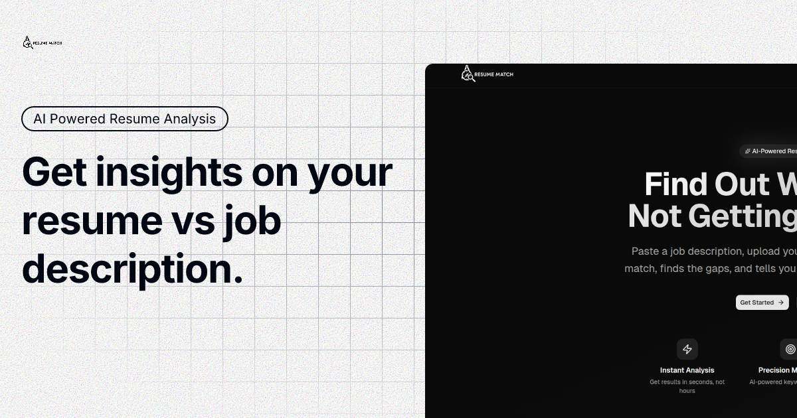

# Resume Match

AI-powered resume analysis tool that helps job seekers optimize their resumes for ATS systems and land more interviews.



## Features

- **AI-Powered Analysis** - Get instant feedback on how well your resume matches a job description
- **Keyword Matching** - Identify missing keywords that ATS systems look for
- **Match Score** - Receive a numerical score indicating fit percentage
- **Actionable Suggestions** - Get specific recommendations to improve your resume
- **Secure Authentication** - User accounts with Better-Auth
- **Analysis History** - Save and revisit past resume analyses
- **Dark/Light Theme** - Fully responsive design with theme support

## Tech Stack

- **Framework**: Next.js 16.2.1 (App Router)
- **UI**: React 19.2.4, Tailwind CSS v4, shadcn/ui, Radix UI
- **Database**: Neon PostgreSQL with Drizzle ORM
- **Authentication**: Better-Auth
- **AI**: OpenRouter API for resume analysis
- **PDF Processing**: pdf-parse, pdfjs-dist
- **Deployment**: Vercel-ready

## Getting Started

### Prerequisites

- Node.js 20+
- PostgreSQL database (we use Neon)
- OpenRouter API key

### Environment Variables

Copy `.env.example` to `.env.local` and fill in your values:

```bash
cp .env.example .env.local
```

Required variables:

| Variable | Description |
|----------|-------------|
| `DATABASE_URL` | PostgreSQL connection string |
| `BETTER_AUTH_SECRET` | Random secret for auth encryption |
| `BETTER_AUTH_URL` | Your app URL (http://localhost:3000 for dev) |
| `OPENROUTER_API_KEY` | API key from openrouter.ai |
| `NEXT_PUBLIC_APP_URL` | Public URL of your app |

### Installation

```bash
# Install dependencies
pnpm install

# Run database migrations
pnpm db:migrate

# Start development server
pnpm dev
```

Open [http://localhost:3000](http://localhost:3000) with your browser.

### Build for Production

```bash
pnpm build
pnpm start
```

## Project Structure

```
app/
├── page.tsx              # Home page with upload section
├── layout.tsx            # Root layout with metadata
├── globals.css           # Global styles
├── api/                  # API routes
│   └── analyze/          # Resume analysis endpoint
│   └── auth/             # Better-Auth handlers
components/
├── ui/                   # shadcn/ui components
├── Navbar.tsx            # Navigation bar
├── Hero.tsx              # Landing hero section
├── UploadSection.tsx     # Resume upload & analysis
lib/
├── auth-client.ts        # Auth client setup
├── auth.ts               # Auth server setup
├── db.ts                 # Database connection
src/
└── schema.ts             # Drizzle database schema
public/
└── Resume-Match-Logos/   # Logo assets
```

## Database Schema

The app uses Drizzle ORM with the following main tables:

- `user` - User accounts
- `session` - Auth sessions
- `analysis_results` - Stored resume analysis results

Run migrations after schema changes:

```bash
pnpm db:generate   # Generate migration
pnpm db:migrate   # Apply migration
pnpm db:push      # Push schema directly (dev only)
```

## Deployment

### Vercel (Recommended)

1. Push your code to GitHub
2. Import project in Vercel
3. Add environment variables in Vercel dashboard
4. Deploy

The `vercel.json` or project settings should include:
- Build Command: `pnpm build`
- Output Directory: `.next`
- Install Command: `pnpm install`

### Environment Variables for Production

Make sure to update these for production:

```env
BETTER_AUTH_URL=https://your-domain.com
NEXT_PUBLIC_APP_URL=https://your-domain.com
```

## API Routes

- `POST /api/analyze` - Analyze resume against job description
- `GET|POST /api/auth/*` - Better-Auth authentication endpoints

## Contributing

1. Fork the repository
2. Create a feature branch
3. Commit your changes
4. Push to the branch
5. Open a Pull Request

## License

MIT License - feel free to use this project for personal or commercial purposes.

## Support

If you encounter any issues or have questions:
- Open an issue on GitHub
- Check existing issues for solutions

---

Built with Next.js, Tailwind CSS, and OpenRouter AI.
